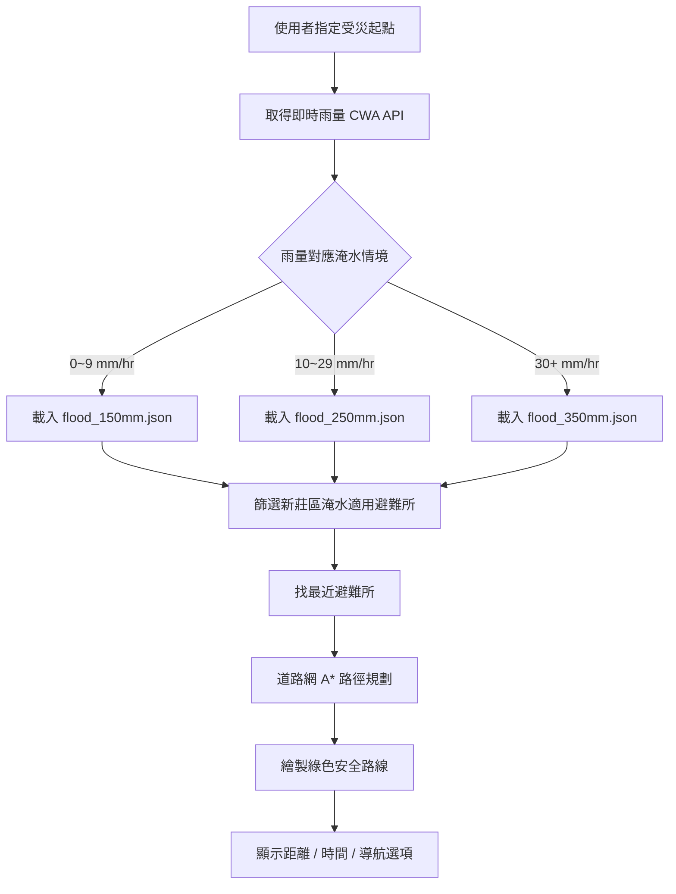

# 新莊五大水系防災導引 GIS 平台
## 系統說明與簡報製作資料

> 本文件供組員撰寫報告、製作簡報使用。內容涵蓋專案背景、功能介紹、技術架構、演算法說明、資料來源、操作方式與答辯建議。

---

## 一、專案概述

### 1.1 專案名稱
**新莊區五大支流避難導引 GIS 平台**（網頁標題：新莊五大水系防災導引）

### 1.2 開發背景
新北市新莊區境內有五大支流（中港大排、塔寮坑溪、潭底溝、十八份坑溪、啞口坑溪）匯入大漢溪，每逢豪雨容易發生淹水。一般導航 App（如 Google Maps）只會規劃**最短或最快路徑**，不會考慮河岸危險與淹水潛勢，民眾在緊急避難時可能誤入低窪區域。

本系統結合 **GIS 空間資料**、**即時降雨觀測** 與 **自訂路徑演算法**，為新莊區居民提供「**安全優先、非最短路**」的動態避難導引。

### 1.3 核心設計理念
| 原則 | 說明 |
|------|------|
| 安全優先 | 路徑規劃優先避開河岸與淹水潛勢區，而非走最短距離 |
| 動態調整 | 依即時雨量切換淹水情境，雨越大避災權重越高 |
| 真實可行走 | 路徑沿 OpenStreetMap 真實道路網計算，非抽象格線 |
| 不做風險等級判定 | 系統只呈現雨量與空間危險因子，不替使用者下「高/中/低風險」結論 |

### 1.4 目標使用者
- 新莊區居民（暴雨時需緊急避難）
- 防災人員（展示、測試不同降雨情境下的避難路線）
- 課程評審老師（展示 GIS 整合與演算法能力）

---

## 二、系統功能一覽

### 2.1 地圖與圖層顯示
| 圖層 | 說明 | 資料檔 |
|------|------|--------|
| 流域集水區背景 | 新莊流域範圍面 | `xinzhuang_basin.json` |
| 河流氾濫範圍面 | 五大支流溢流危險區（Polygon） | `xinzhuang_river_polygons.json` |
| 真實支流河道線 | 五大支流中心線（LineString） | `xinzhuang_real_rivers.json` |
| 水系標記點 | 五大水系名稱標記 | `xinzhuang_river_labels.json` |
| 官方避難收容所 | 新莊區、適用淹水避難所 | `xinzhuang_shelters.json` |
| 淹水潛勢範圍 | 依雨量動態切換 150/250/350mm 情境 | `flood_150mm.json` 等 |
| 安全避難路線 | 綠色折線，道路網 A* 計算結果 | 即時運算 |

右側 ⚙️ 面板可開關各圖層，並支援上傳自訂 GeoJSON。

### 2.2 即時降雨監測
- 資料來源：**中央氣象署開放資料** `O-A0002-001`（自動雨量站）
- 測站：**新莊站 C0ACA0**
- 更新頻率：每 5 分鐘自動刷新
- 顯示內容：目前時雨量 (mm/hr)、降雨狀態文字（如「目前無降雨」「大雨」）

### 2.3 動態避難路線規劃（系統核心）
使用者指定受災起點後，系統會：
1. 篩選**新莊區**且**適用淹水避難**的收容所
2. 以直線距離找出**最近**的合格避難所
3. 在**真實道路網**上執行 **A\*** 演算法，計算避開河岸與淹水區的安全路線
4. 顯示步行距離、預估時間，並在地圖畫出**綠色安全路線**

**起點設定方式（三選一）：**
- 📍 偵測我目前位置（GPS）
- 🔍 搜尋地點（Google Places / Geocoding）
- 🖱️ 點擊地圖任一處（測試用）

### 2.4 導航功能（三種層次）
| 功能 | 說明 | 是否避災 |
|------|------|----------|
| 🟢 綠色安全路線 | 系統核心輸出，沿真實道路避開危險區 | ✅ 是 |
| 🧭 逐步導航 | 依綠線產生轉彎指示（出發方向、左/右轉、距離） | ✅ 是 |
| 🚶 Google 導航 | 開啟外部 Google Maps，起點→避難所最短路 | ❌ 否（備援） |

### 2.5 其他功能
- **🌧️ 模擬暴雨**：一鍵切換高雨量（50 mm/hr）測試動態路線變化
- **資訊面板**：五大水系列表、避難所列表、點選查看詳情
- **RWD 響應式**：支援手機瀏覽，左側面板可收合、可拖曳調寬
- **HTTPS 本機連線**：`npm run host` 可讓手機用 GPS 定位測試

---

## 三、系統架構

### 3.1 技術堆疊
| 類別 | 技術 |
|------|------|
| 前端框架 | 原生 HTML / CSS / JavaScript（無 React/Vue） |
| 建置工具 | Vite 8 |
| 地圖引擎 | Google Maps JavaScript API |
| 地點搜尋 | Google Places Autocomplete + Geocoding API |
| 即時資料 | 中央氣象署開放資料 API |
| 道路網資料 | OpenStreetMap（Overpass API 預先抓取） |
| 空間資料格式 | GeoJSON |
| 座標轉換 | TWD97 → WGS84（自訂公式，用於部分原始 SHP 資料） |

### 3.2 系統流程圖



### 3.3 檔案結構
```
GIS/
├── index.html              # 網頁介面（左側面板 + 地圖 + 右側圖層控制）
├── main.js                 # 主程式（地圖、演算法、API、UI 邏輯）
├── vite.config.js          # Vite 設定（HTTPS + 對外連線）
├── .env                    # API 金鑰（勿上傳 Git）
├── package.json
├── docs/
│   └── 系統說明與簡報資料.md   # 本文件
├── public/                 # 靜態 GeoJSON 與道路網
│   ├── xinzhuang_basin.json
│   ├── xinzhuang_river_polygons.json
│   ├── xinzhuang_real_rivers.json
│   ├── xinzhuang_river_labels.json
│   ├── xinzhuang_real_spots.json
│   ├── xinzhuang_shelters.json
│   ├── flood_150mm.json
│   ├── flood_250mm.json
│   ├── flood_350mm.json
│   └── road_network.json   # OSM 道路網（43,695 節點）
└── scripts/
    ├── clip_flood.py       # 淹水潛勢圖裁切與座標轉換
    └── build_road_network.py  # OSM 道路網抓取
```

---

## 四、核心演算法說明（簡報重點）

### 4.1 為什麼需要自訂演算法？
若只用 Google Directions API：
- 只會走**最短路徑**
- **不知道**淹水潛勢圖與河岸危險
- 無法依**即時雨量**動態調整

因此本系統實作**道路網 A\*** 演算法，在真實可走的道路上，依危險成本加權找路。

### 4.2 道路網 A* 演算法

**步驟：**
1. 從 `road_network.json` 建立道路節點鄰接表（OpenStreetMap 新莊區可步行道路）
2. 將使用者起點、避難所座標**吸附**到最近的道路節點
3. 預先計算每個道路節點到最近河岸的距離
4. 對每個節點計算「危險加權單位」：

| 條件 | 加權單位 |
|------|----------|
| 距河道 ≤ 50m | +4 |
| 距河道 ≤ 120m | +2 |
| 落在淹水潛勢多邊形內 | +8 |
| 雨量係數 rainFactor | 1 ~ 3 倍（雨越大係數越高） |

5. **邊權重** = 實際道路長度 × (1 + 兩端節點危險加權平均)
6. 以 A\* 搜尋成本最低路徑（啟發函數 = 到終點直線距離）
7. 回溯路徑，繪製綠色折線

**公式示意：**
```
邊成本 = 道路長度 × (1 + (起點危險 + 終點危險) / 2)
雨量係數 = 1 + min(目前時雨量, 40) / 20
```

### 4.3 淹水情境動態切換
| 即時時雨量 | 載入淹水潛勢圖 | 代表情境 |
|------------|----------------|----------|
| < 10 mm/hr | flood_150mm.json | 6 小時降雨 150mm |
| 10 ~ 29 mm/hr | flood_250mm.json | 6 小時降雨 250mm |
| ≥ 30 mm/hr | flood_350mm.json | 6 小時降雨 350mm |

雨量更新時，若已有避難路線會**自動重算**。

### 4.4 淹水判斷：Point-in-Polygon
使用**射線法（Ray Casting）**判斷道路節點是否落在淹水多邊形內，支援 Polygon 內環（孔洞）處理。

### 4.5 後備機制
若道路網未載入或起終點道路不連通，系統會退回**格網式 A\***（在虛擬格子上計算，僅作備援）。

---

## 五、資料來源

| 資料 | 來源 | 處理方式 |
|------|------|----------|
| 五大支流 / 流域 | 組員整理之 GeoJSON | 直接使用或 TWD97→WGS84 轉換 |
| 官方避難收容所 | 新北市政府開放資料 | 篩選 `district === '新莊區'` 且 `suit_for_f === '是'` |
| 淹水潛勢圖 | 經濟部水利署 WRA | 下載全台 6hr 情境 SHP/GeoJSON → `clip_flood.py` 裁切新莊、轉 WGS84 |
| 道路網 | OpenStreetMap | `build_road_network.py` 透過 Overpass API 抓取 |
| 即時雨量 | 中央氣象署 O-A0002-001 | 前端每 5 分鐘 fetch，測站 C0ACA0 |

### 淹水資料前處理（`scripts/clip_flood.py`）
原始水利署資料問題：
- 檔案極大（全台，20~90 MB）
- 格式為 `GeometryCollection`，非標準 `FeatureCollection`
- 座標為 TWD97

處理後：
- 裁切至新莊區範圍
- 轉換為 WGS84 GeoJSON
- 檔案縮小至 250KB ~ 1.5MB

---

## 六、介面說明

### 6.1 左側面板（防災導引）
- 地點搜尋框 + 搜尋按鈕
- GPS 定位按鈕
- 即時雨量顯示
- 模擬暴雨按鈕
- 避難導引資訊區（起點、避難所、距離、時間）
- 逐步導航 / Google 導航按鈕
- 五大水系 / 避難所資訊列表

**面板操作：**
- 右緣拖曳 → 調整寬度（260px ~ 640px，會記憶）
- 右緣 `‹` 把手 → 收合 / 展開

### 6.2 右側面板（圖層控制）
- 點右上角 ⚙️ 開啟
- 可切換各圖層顯示
- 可上傳自訂 GeoJSON

### 6.3 手機版（RWD）
- 螢幕 ≤ 768px：地圖全屏，面板覆蓋式浮動，預設收合
- 需 HTTPS 才能使用 GPS（`npm run host`）

---

## 七、環境設定與執行方式

### 7.1 必要 API 金鑰（`.env`）
```env
VITE_GOOGLE_MAPS_API_KEY=你的_Google_金鑰
VITE_CWA_API_KEY=你的_氣象署授權碼
```

**Google Cloud 需啟用：**
- Maps JavaScript API
- Places API
- Geocoding API
- Directions API（若未來擴充）

**金鑰 HTTP 參照網址需加入：**
```
http://localhost:5173/*
https://localhost:5173/*
https://你的區網IP:5173/*
```

### 7.2 安裝與啟動
```bash
# 安裝依賴
npm install

# 本機開發（HTTPS + 對外連線，手機可測 GPS）
npm run host

# 僅本機
npm run dev

# 正式建置
npm run build
npm run preview
```

### 7.3 手機連線測試
1. 電腦執行 `npm run host`
2. 看終端機 **Network** 網址（如 `https://192.168.x.x:5173/`）
3. 手機連同一 Wi-Fi，瀏覽器開啟該網址
4. 出現憑證警告時選「繼續前往」（自簽憑證）
5. 允許定位權限後可使用 GPS

### 7.4 重新產生資料（選用）
```bash
# 重新抓取 OSM 道路網
python3 scripts/build_road_network.py

# 裁切淹水潛勢圖（需原始水利署檔案）
python3 scripts/clip_flood.py 輸入.json 輸出.json 情境標籤
```

---

## 八、組員分工建議（供報告撰寫參考）

| 成員 | 負責範圍 | 主要產出 |
|------|----------|----------|
| 同學 A（GIS 資料） | 五大支流圖層、流域面、河道線、標記點、避難所 GeoJSON 整理 | `public/` 內河流相關 JSON |
| 同學 B（系統整合） | 即時雨量 API、淹水潛勢圖、道路網 A*、導航、RWD | `main.js`、演算法、API 串接 |

**本系統刻意不做：** 風險等級判定（高/中/低風險標籤），僅呈現雨量與空間避災路徑。

---

## 九、簡報建議流程（5~8 分鐘）

### Slide 1：問題提出
- 新莊五大支流豪雨淹水問題
- 一般導航不走安全路線的風險

### Slide 2：解決方案
- GIS + 即時雨量 + 自訂 A* 的動態避難平台
- 「安全優先、非最短路」

### Slide 3：系統架構圖
- 使用本文第三節流程圖

### Slide 4：資料層展示
- 五大支流、淹水潛勢圖、避難所圖層截圖

### Slide 5：演算法說明（重點）
- 道路網 A* 成本函數
- 雨量如何影響路徑

### Slide 6：Live Demo
1. 開啟網頁，展示即時雨量
2. 點地圖或搜尋「輔仁大學」設起點
3. 展示綠色安全路線
4. 按「模擬暴雨」→ 路線改變、淹水圖層切換
5. 按「逐步導航」展示轉彎指示

### Slide 7：與 Google 導航對比
- 綠線（避災）vs Google 最短路（可能穿淹水區）
- 說明為何需要自訂演算法

### Slide 8：限制與未來展望
- 見第十節

---

## 十、已知限制與未來改進

### 10.1 目前限制
| 項目 | 說明 |
|------|------|
| 避難所選擇 | 目前只選「直線距離最近」的合格避難所，未比較多個避難所的安全路徑成本 |
| 道路網覆蓋 | 依 OSM 資料完整性，部分巷道可能缺失 |
| Google 金鑰 | 需正確設定網域限制，否則地圖無法載入 |
| 手機 GPS | 需 HTTPS 連線，自簽憑證需手動信任 |
| 雨量與淹水圖對應 | 採分段對應（150/250/350mm 情境），非連續插值 |

### 10.2 未來可擴充
- 比較多個避難所，推薦「最安全」而非「最近」
- 加入即時淹水通報（若 API 可用）
- 語音導航
- 多語系介面
- 離線模式（PWA）

---

## 十一、常見問題（FAQ）

**Q1：為什麼路線不是最短？**  
A：本系統設計目標是安全避災，會刻意繞開河岸與淹水潛勢區。

**Q2：綠色路線可以直接走嗎？**  
A：可以。綠線是沿真實 OSM 道路計算的，不是抽象格線。

**Q3：Google 導航和逐步導航差在哪？**  
A：逐步導航完全沿綠色安全路線；Google 導航是外部 App 的最短路，不保證避災。

**Q4：搜尋地點沒反應？**  
A：多為 Google API 金鑰網域限制。請確認 Console 已加入目前網址，並從下拉選單選擇地點或按「搜尋」。

**Q5：模擬暴雨按鈕做什麼？**  
A：將雨量設為 50 mm/hr，觸發較嚴重淹水情境，方便展示路線動態變化。

---

## 十二、課程作業對照（基本 / 加分項）

| 作業要求 | 本系統對應 |
|----------|------------|
| Google Maps 整合 | ✅ 地圖底圖、標記、圖層、搜尋 |
| POI 標記 | ✅ 避難所、水系標記 |
| Place Search | ✅ Google Places Autocomplete + Geocoding |
| 自訂演算法 | ✅ 道路網 A* 避災路徑 |
| 即時資料串接 | ✅ 中央氣象署雨量 API |
| 動態路徑調整 | ✅ 雨量變化自動重算路線 |
| RWD | ✅ 手機可瀏覽、面板可收合 |

---

## 附錄：新莊五大支流一覽

| 支流名稱 | 圖層顏色（約） |
|----------|----------------|
| 中港大排 | 青綠色 |
| 塔寮坑溪 | 藍色 |
| 潭底溝 | 黃色 |
| 十八份坑溪 | 紅色 |
| 啞口坑溪 | 紫色 |
| 大漢溪（幹流） | 深藍色 |

---

*文件版本：2026-06-07｜專案路徑：`/Applications/XAMPP/xamppfiles/htdocs/GIS`*
